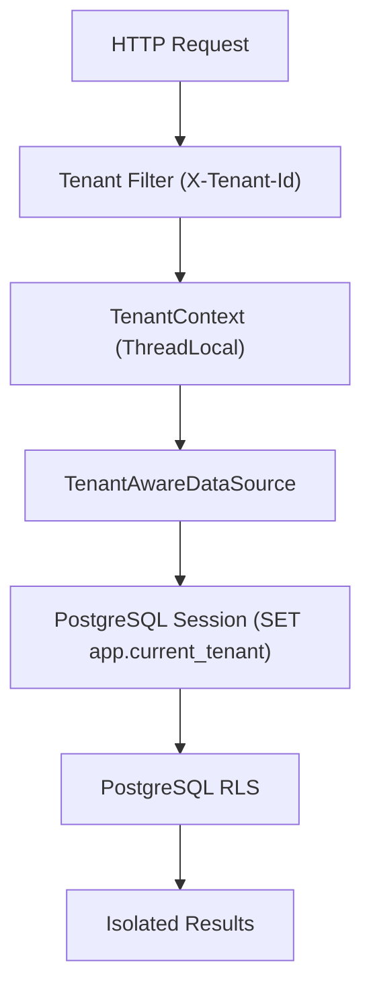

# Lab 03 — Multi-Tenant System with PostgreSQL RLS

> **“Multi-tenancy is not an application feature — it is a data integrity boundary.”**

This project explores tenant isolation enforced directly at the database level using **PostgreSQL Row Level Security (RLS)**.

---

## Why this exists

This project is part of the Asclépio Platform, a set of incremental backend labs designed to explore production-grade architectural patterns in a controlled and reproducible environment.

Within this context, Lab 03 focuses specifically on multi-tenant data isolation.

The goal is not to build a standalone system, but to validate one critical assumption of the platform:

`Tenant isolation must remain safe even when application layers are bypassed or misconfigured.`

Instead of relying on service-layer filtering, this lab evaluates a database-first approach using **RLS** as a hard security boundary.

---

## Tech Stack

* **Language/Framework:** Java 17 & Spring Boot (MVC + JDBC)
* **Database & Migrations:** PostgreSQL 17 + RLS & Flyway
* **Testing Infrastructure:** Testcontainers (PostgreSQL) & MockMvc

---

## Architecture (High Level)

The tenant context is resolved from the incoming HTTP request and propagated downstream until it binds to the database session:



---

## Security Model (RLS)

Tenant isolation is enforced entirely within PostgreSQL via schema policies. No filtering is done at the service level.

```sql
CREATE POLICY patients_tenant_isolation
ON patients
USING (
    tenant_id = current_setting('app.current_tenant', true)::uuid
)
WITH CHECK (
    tenant_id = current_setting('app.current_tenant', true)::uuid
);

```

---

## Key Decisions

### 1. JDBC instead of JPA (Intentional)

I intentionally avoided JPA because ORM abstraction hides when and how session-level database state is applied, which is critical in RLS-based systems.

### 2. Tenant propagation is explicit

The context flow is strict and predictable:

> `X-Tenant-Id` Header $\rightarrow$ Filter $\rightarrow$ `ThreadLocal` $\rightarrow$ DB Session

No hidden magic, and no interceptors beyond what is strictly necessary.

### 3. RLS is the only enforcement layer

If RLS fails, the system is considered broken. The application code does not re-implement or duplicate security rules.

---

## Challenges Encountered

### Thread-local leakage

Without strict cleanup, tenant contexts leaked between requests when threads were reused by the container.

* **Fix:** Enforced a lifecycle boundary at the filter level using a `try-finally` block:

```java
try {
    TenantContext.setTenantId(tenantId);
    filterChain.doFilter(request, response);
} finally {
    TenantContext.clear(); // Safe eviction
}

```

### PostgreSQL edge cases

Empty or missing session values break native UUID casting (`::uuid`) in PostgreSQL.

* **Fix:** Safely coalesced empty strings into nulls before casting:

```sql
NULLIF(current_setting('app.current_tenant', true), '')

```

### Test stability

Early versions used brittle `count(*)` assertions and order-based checks, causing flaky builds.

* **Fix:** Refactored the suite to use **Testcontainers (Real PostgreSQL)**. Tests now isolate and validate:
* Data visibility per tenant.
* Tenant consistency in HTTP responses.

---

## Constraints
* Single database (no schema-per-tenant model)
* Stateless HTTP layer
* Shared connection pool (HikariCP)
* PostgreSQL as single source of truth for isolation

---

## What this project proves

Multi-tenant isolation cannot rely on application-level filtering in real systems where connection reuse, ORM abstraction, and concurrency introduce failure modes.

It validates that:

* PostgreSQL RLS can enforce isolation independently of application logic
* Session-based context (`current_setting`) is sufficient for tenant binding
* Application layers can remain unaware of security enforcement
* Integration tests must operate against real infrastructure to be meaningful

In the context of the Asclépio Platform, this becomes a reusable pattern for secure data partitioning across future services.

---

## What’s next

Possible extensions for this lab include:

* Evaluate ORM caching behavior under RLS session constraints
* Introduce tenant-aware observability (MDC + trace correlation)
* Validate this model under AWS RDS + ECS deployment constraints