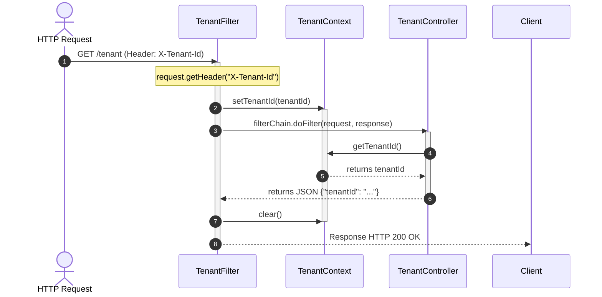

# Phase 02 - Tenant Context

This phase introduces tenant context propagation inside the Spring Boot application.

The goal is to extract tenant information from an HTTP request and make it available throughout the request lifecycle.

## Goal

Implement the following flow:



## Tenant Context

Tenant information is stored using ThreadLocal.

```java
public class TenantContext {
    
    private static final ThreadLocal<String> TENANT = new ThreadLocal<>();
    
    public static void setTenantId(String tenantId) {
        TENANT.set(tenantId);
    }
    
    public static String getTenantId() {
        return TENANT.get();
    }
    
    public static void clear() {
        TENANT.remove();
    }
}
```

This allows tenant information to be associated with the current request thread.

## Tenant Filter

A servlet filter intercepts every incoming request and extracts the tenant identifier from the HTTP header.

```java
@Component
public class TenantFilter extends OncePerRequestFilter {
    
    private static final String TENANT_HEADER = "X-Tenant-Id";
    
    @Override
    protected void doFilterInternal(
            HttpServletRequest request,
            HttpServletResponse response,
            FilterChain filterChain)
            throws ServletException, IOException {
    
        String tenantId = request.getHeader(TENANT_HEADER);
    
        try {
            TenantContext.setTenantId(tenantId);
            filterChain.doFilter(request, response);
        } finally {
            TenantContext.clear();
        }
    }

}
```

## Validation Endpoint

A simple endpoint was created to validate tenant propagation.

```java
@RestController
@RequestMapping("/tenant")
public class TenantController {
    
    @GetMapping
    public Map<String, String> currentTenant() {
        return Map.of(
                "tenantId",
                String.valueOf(TenantContext.getTenantId())
        );
    }

}
```

## Manual Validation

Request without tenant header:

```bash
curl localhost:8080/tenant
```

Response:

```json
{
"tenantId":"null"
}
```

Request with tenant header:

```bash
curl localhost:8080/tenant
-H "X-Tenant-Id: hospital-a"
```

Response:

```json
{
"tenantId":"hospital-a"
}
```

Additional validation:

```bash
curl localhost:8080/tenant
-H "X-Tenant-Id: hospital-b"

curl localhost:8080/tenant
-H "X-Tenant-Id: hospital-c"
```
Each request returned the tenant value provided in the header.

## ThreadLocal Lifecycle

A common misconception is that ThreadLocal values are shared across concurrent threads.

This is not the case.

Each thread maintains its own ThreadLocal storage.

```text
worker-1 → hospital-a
worker-2 → hospital-b
worker-3 → hospital-c
```

Calling:

```java
TenantContext.clear();
```
or:

```java
TENANT.remove();
```

only removes the value associated with the current thread.

The main risk is not concurrent access.

The real risk is thread reuse.

Application servers reuse worker threads to process multiple requests.

Without cleanup, a thread that previously handled one tenant could accidentally expose the same tenant value to a future request.

For this reason, tenant cleanup must always be performed inside a finally block.

```java
...
try {
    TenantContext.setTenantId(tenantId);
    filterChain.doFilter(request, response);

} finally {
    TenantContext.clear();
}
...
```

This guarantees cleanup even when exceptions occur during request processing.

## Outcome

At the end of this phase:

* Tenant information is extracted from HTTP requests
* TenantContext is populated automatically
* Tenant information is accessible from application code
* ThreadLocal lifecycle is understood
* Context leakage is prevented through proper cleanup
* Tenant propagation is ready for database integration in future phases
