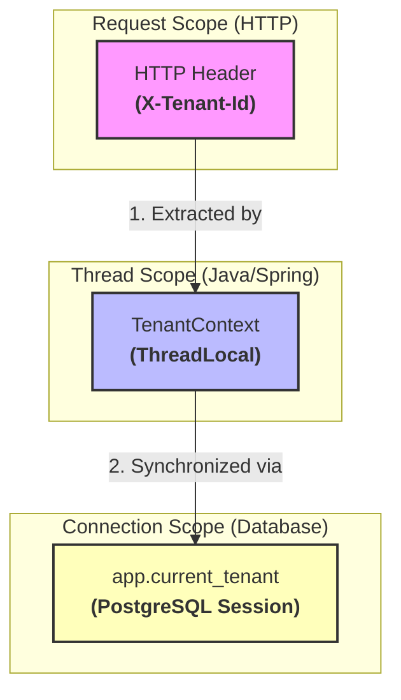

# Phase 04 - Session Variables

## Goal

Understand how PostgreSQL session variables behave when accessed through a Spring Boot application.

This phase connects the tenant context propagated by the application with the session variables used by PostgreSQL Row Level Security (RLS).

---

## Experiment 01 - Verify Database Connectivity

Endpoint:

```java
GET /database/user
```

Executed query:

```sql
SELECT current_user;
```

Result:

```json
{
"currentUser": "migration_user"
}
```

Conclusion:

The application is successfully connected to PostgreSQL and can execute SQL statements using JdbcTemplate.

---

## Experiment 02 - Set Session Variable

Endpoint:

```java
POST /database/tenant/default
```

Executed query:

```sql
SET app.current_tenant = 'hospital-a';
```

Response:

```text
Tenant set to default : hospital-a
```

---

## Experiment 03 - Read Session Variable

Endpoint:

```java
GET /database/tenant/current
```

Executed query:

```sql
SELECT current_setting('app.current_tenant', true);
```

Response:

```text
hospital-a
```

Conclusion:

The session variable was successfully stored in the PostgreSQL connection.

---

## Experiment 04 - Synchronize TenantContext

Endpoint:

```java
POST /database/tenant/sync
```

Request:

```bash
curl -X POST http://localhost:8080/database/tenant/sync \
-H "X-Tenant-Id: hospital-b"
```

Executed query:

```sql
SELECT set_config('app.current_tenant', ?, false);
```

Response:

```json
{
"tenantContext": "hospital-b",
"sessionTenant": "hospital-b"
}
```

Conclusion:

The tenant received from the HTTP request can be propagated to PostgreSQL session variables.

---

## Experiment 05 - Reset Session Variable

Endpoint:

```java
POST /database/tenant/reset
```

Executed query:

```sql
RESET app.current_tenant;
```

Validation:

```bash
curl http://localhost:8080/database/tenant/current
```

Response:

```text
No tenant set
```

Conclusion:

Session variables can be cleared explicitly and are scoped to the PostgreSQL connection.

---

## Key Learnings

TenantContext and PostgreSQL session variables have different lifecycles.



The PostgreSQL RLS policies created in Lab 02 depend on:

```sql
current_setting('app.current_tenant', true)
```

Therefore, tenant isolation is enforced using values stored in the database connection, not in the application thread.

Connection pools may reuse existing connections. Because of that, applications must explicitly synchronize the tenant context with the database connection before executing tenant-scoped operations.

---

## Production Considerations

This phase demonstrated session variable behavior using dedicated endpoints.

In a production application, tenant synchronization should occur automatically whenever a database connection is used.

The application must never assume that a connection already contains the correct tenant value because connections are reused by the connection pool.