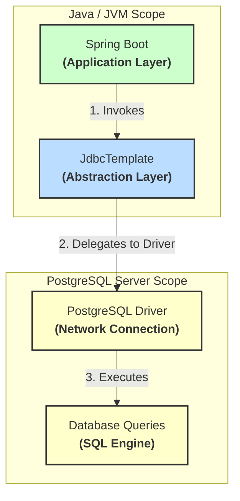
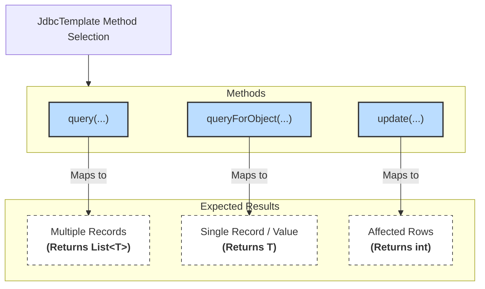
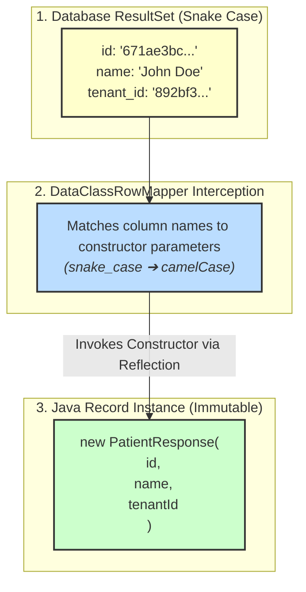

# Phase 05 - Tenant Aware Data Access

## Goal

Validate database access from Spring Boot using JdbcTemplate before applying tenant isolation rules.

This phase introduces basic data access patterns and prepares the application for RLS-based tenant isolation in the next phases.

---

## Database Access with JdbcTemplate

The application accesses PostgreSQL using JdbcTemplate.

The objective is to validate:



---

## Query Multiple Records

For queries returning multiple records, JdbcTemplate query() is used.

Example:

```java
List<PatientResponse> patients = jdbcTemplate.query(
    "SELECT id, tenant_id, name FROM patients",
    new DataClassRowMapper<>(PatientResponse.class)
);
```

The result is mapped into a List of DTO objects using DataClassRowMapper.

Example endpoint:

```java
@GetMapping("/patients")
public ResponseEntity<List<PatientResponse>> getPatients() {
    List<PatientResponse> tenants = jdbcTemplate.query(
            "SELECT id, tenant_id, name FROM patients",
            new DataClassRowMapper<>(PatientResponse.class)
    );

    return ResponseEntity.ok(tenants);
}
```

---

## Query Single Record

For queries returning a single object, JdbcTemplate queryForObject() is used.

Example:

```java
TenantResponse tenant = jdbcTemplate.queryForObject(
    "SELECT id, name FROM tenants where id = ?",
    new DataClassRowMapper<>(TenantResponse.class),
    id
);
```

When no record is found, EmptyResultDataAccessException is handled and converted into HTTP 404.

---

## Tenant Query Example

Endpoint:

```bash
curl http://localhost:8080/database/tenants
```

Result:

```json
[
  {
    "id":"671ae306-baf0-4a9c-8374-136322f033c3",
    "name":"Hospital A"
  },
  {
    "id":"80d34bcd-e11f-4051-afe7-6ea607793c6b",
    "name":"Hospital B"
  }
]
```

---

## Patient Query Example

Endpoint:

```bash
curl http://localhost:8080/database/patients
```

Result:

```json
[
  {
    "id":"55eac6fc-ea63-4756-ba98-cc2baa6e8399",
    "tenantId":"ed3b3b4a-cbad-4565-b77a-53b34b79756f",
    "name":"Alice"
  },
  {
    "id":"825ff9da-d0cc-4439-8ef5-93b0f58a3d87",
    "tenantId":"f920f4f5-7790-4ba5-9b14-6d7393ed4512",
    "name":"Bob"
  }
]
```

---

## RLS Behavior During This Phase

The application datasource is currently configured using:

```text
migration_user
```

This role has:

```sql
BYPASSRLS
```

permission.

Because of this, queries executed by the application are not restricted by Row Level Security policies.

The following query returns records from multiple tenants:

```sql
SELECT id, tenant_id, name
FROM patients;
```

This behavior is expected because the goal of this phase is to validate database access patterns.

---

## Key Learnings

JdbcTemplate provides different methods depending on the expected result:



DataClassRowMapper allows mapping query results directly into Java records.



---

## Next Step

The next phase will replace the migration role with the application role and validate tenant isolation using PostgreSQL Row Level Security.