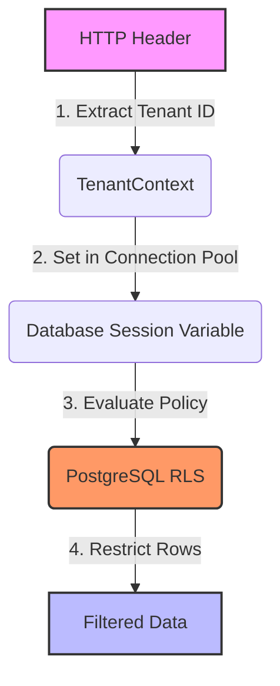
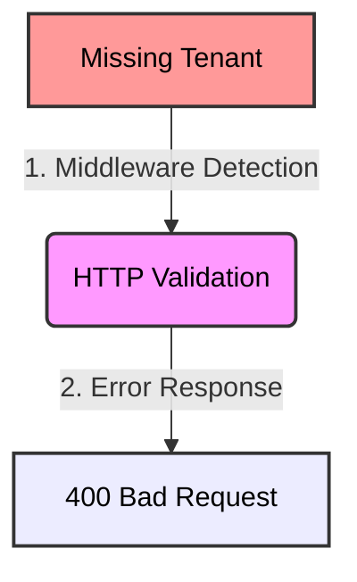
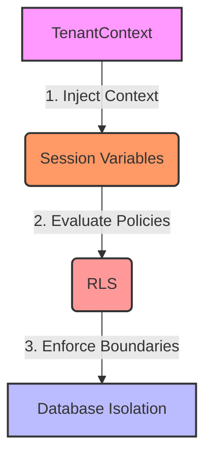

# Phase 06 - RLS Integration

## Goal

Integrate Spring Boot tenant propagation with PostgreSQL Row Level Security (RLS).

This phase validates that tenant isolation is enforced by the database instead of application code.

The objective is to connect:



---

## Separating Migration and Runtime Users

During previous phases the application datasource was configured using:

```text
migration_user
```

This role was created with:

```sql
ALTER ROLE migration_user BYPASSRLS;
```

As a consequence, application queries bypassed RLS and returned data from multiple tenants.

Example:

```sql
SELECT id, tenant_id, name
FROM patients;
```

Result:

```text
All records returned
```

---

This phase introduces role separation.

Datasource configuration:

```yaml
spring:
    datasource:
    username: app_user
    password: app_password
    
    flyway:
    user: migration_user
    password: migration_password
```

Responsibilities become:

```text
migration_user
→ schema evolution
→ seed data
→ bypass RLS

app_user
→ application runtime
→ constrained access
→ RLS enforcement
```

This separation reproduces a common production architecture pattern.

---

## Flyway Permission Issue

After switching datasource to app_user the application failed during startup.

Error:

```text
ERROR: permission denied for table flyway_schema_history
```

Cause:

Flyway metadata tables were created by migration_user.

Solution:

Configure Flyway and application datasource independently.

This allows migrations to run while application queries remain restricted.

---

## Synchronizing Tenant Context with PostgreSQL

Tenant synchronization is performed through PostgreSQL session variables.

Implementation:

```java
jdbcTemplate.queryForObject(
    "SELECT set_config('app.current_tenant', ?, false)",
    String.class,
    tenantId
);
```

Using parameter binding prevents dynamic SQL construction.

Current tenant can be verified with:

```sql
SELECT current_setting('app.current_tenant', true)
```

---

## Validating Tenant Input

Initially the implementation used:

```java
if (tenantId == null) {
    tenantId = "NOT_DEFINED";
}
```

This approach masked invalid requests and produced database errors.

Final approach:



Example:

```bash
curl -s -X POST
http://localhost:8080/database/tenant/sync
| jq
```

Response:

```json
{
"error": "Tenant header is required"
}
```

---

## RLS Filtering Behavior

After configuring:

```text
Datasource → app_user
Session → current_tenant
```

Queries started respecting tenant isolation.

Tenant synchronization:

```bash
curl -s -X POST \
http://localhost:8080/database/tenant/sync \
-H "X-Tenant-Id: f920f4f5-7790-4ba5-9b14-6d7393ed4512"
| jq
```

Response:

```json
{
    "tenantContext": "f920f4f5-7790-4ba5-9b14-6d7393ed4512",
    "sessionTenant": "f920f4f5-7790-4ba5-9b14-6d7393ed4512"
}
```

Query:

```bash
curl -s \
http://localhost:8080/database/patients \
| jq
```

Response:

```json
[
    {
        "id": "825ff9da-d0cc-4439-8ef5-93b0f58a3d87",
        "tenantId": "f920f4f5-7790-4ba5-9b14-6d7393ed4512",
        "name": "Bob"
    }
]
```

No tenant filtering exists in Java code.

Filtering happens entirely in PostgreSQL.

---

## Behavior with Unknown Tenant

Synchronization accepts any valid UUID.

Example:

```bash
curl -s -X POST \
http://localhost:8080/database/tenant/sync \
-H "X-Tenant-Id: 99999999-9999-9999-9999-999999999999"
```

Query result:

```json
[]
```

This phase implements:

```text
Data Isolation
```

and does not implement:

```text
Tenant Validation
```

These concerns remain independent.

---

## Understanding NULL Behavior

RLS policy:

```sql
tenant_id =
    current_setting(
    'app.current_tenant',
    true
    )::uuid
```

When the session variable is missing:

```text
current_setting(...)
→ NULL
```

PostgreSQL evaluates:

```sql
tenant_id = NULL
```

Result:

```text
UNKNOWN
↓
row filtered
```

This behavior explains why missing tenant values return empty results instead of throwing exceptions.

---

## Useful CLI Commands

Use silent curl and jq for readable output:

```bash
curl -s http://localhost:8080/database/patients | jq
```

---

## Key Learnings



Database identity affects behavior.

The same SQL executed by different roles may produce different results.
