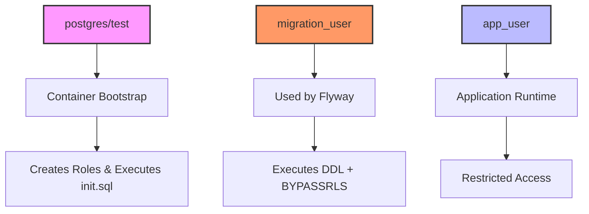
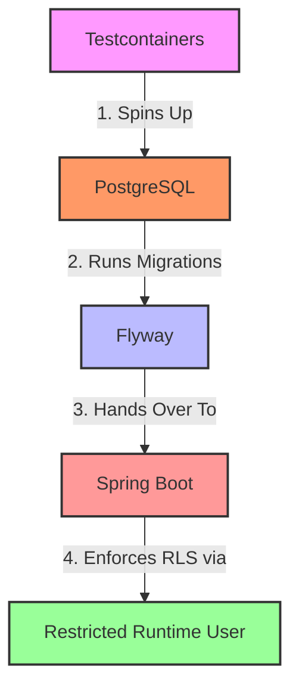

# Phase 07 — Integration Tests with Spring Boot, Testcontainers and PostgreSQL RLS

## Objective

Validate application behavior in an isolated environment using Testcontainers, ensuring that:

* Spring Boot starts correctly
* Flyway migrations execute automatically
* PostgreSQL roles are created during bootstrap
* Runtime uses a restricted database user
* Tests do not depend on a local PostgreSQL instance

This phase introduces integration tests while preserving the separation between infrastructure, migrations and runtime permissions.

---

## Problem Statement

The application previously depended on a manually started PostgreSQL instance:

```text
localhost:5432
```

This approach had limitations:

* tests depended on external infrastructure
* environment configuration could differ between machines
* Flyway migrations could interfere with local databases
* runtime and migration credentials were not isolated

To make tests reproducible, PostgreSQL was moved into Testcontainers.

---

## Dependencies

```xml
<dependency>
    <groupId>org.springframework.boot</groupId>
    <artifactId>spring-boot-testcontainers</artifactId>
    <scope>test</scope>
</dependency>

<dependency>
    <groupId>org.testcontainers</groupId>
    <artifactId>junit-jupiter</artifactId>
    <scope>test</scope>
</dependency>

<dependency>
    <groupId>org.testcontainers</groupId>
    <artifactId>postgresql</artifactId>
    <scope>test</scope>
</dependency>
```

Note:

Testcontainers transitive vulnerabilities were intentionally not overridden because these dependencies exist only in test scope and are not packaged in runtime artifacts.

---

## Initializing PostgreSQL for Tests

Container bootstrap:

```java
@SpringBootTest
@Testcontainers
class TenantRlsIntegrationTest {

    @Container
    static final PostgreSQLContainer<?> postgres =
            new PostgreSQLContainer<>("postgres:17")
                    .withDatabaseName("dbRLSTest")
                    .withInitScript(
                            "db/init/00-test-init.sql"
                    );

}
```

The initialization script runs before Spring Boot starts.

Responsibilities:

* enable required extensions
* create runtime roles
* prepare migration permissions

---

## Dynamic Property Injection

Application configuration points to localhost.

Integration tests override those values dynamically:

```java
@DynamicPropertySource
static void configureProperties(DynamicPropertyRegistry registry) {
    String jdbcUrl = postgres.getJdbcUrl();

    registry.add("spring.flyway.url", () -> jdbcUrl);
    registry.add("spring.flyway.user", () -> MIGRATION_USER);
    registry.add("spring.flyway.password", () -> "migration_password");

    registry.add("spring.datasource.url", () -> jdbcUrl);
    registry.add("spring.datasource.username", () -> APP_USER);
    registry.add("spring.datasource.password", () -> "app_password");
}
```

This guarantees that tests never connect to localhost.

---

## Why @ServiceConnection Was Not Used

Spring Boot provides:

```java
@ServiceConnection
```

This feature simplifies container integration.

However, this lab intentionally separates database responsibilities.

Database roles:



Using `@ServiceConnection` caused datasource credentials to be overridden.

Result:

```text
runtime → container user
```

instead of:

```text
runtime → app_user
```

For this architecture, `@DynamicPropertySource` provided explicit control.

---

## Unexpected Failure During Implementation

Tests kept connecting to:

```text
localhost:5432
```

Root cause was not Flyway.

Spring was executing an additional default test:

```java
@SpringBootTest
class SpringMultitenancyApplicationTests {

    @Test
    void contextLoads() {
    }

}
```

This class loaded the original application configuration and ignored Testcontainers.

Removing or adapting that class solved the issue.

Lesson:

Multiple `@SpringBootTest` classes may initialize independent application contexts.

---

## Runtime Validation

To ensure runtime permissions were applied correctly:

```java
@Test
void readCurrentUser() {

    String currentUser =
            jdbcTemplate.queryForObject(
                    "select current_user",
                    String.class
            );

    System.out.println(
            "Current User: "
                    + currentUser
    );

}
```

Output:

```text
Current User: app_user
```

This confirms that:

* migrations executed with migration_user
* application executed with app_user
* runtime did not inherit elevated privileges

---

## Key Learnings

* Integration tests should not depend on localhost
* Testcontainers improves reproducibility
* Flyway and runtime users may differ
* Container bootstrap is independent of runtime access
* `@ServiceConnection` is useful but not universal
* `@DynamicPropertySource` provides explicit configuration control
* `SELECT current_user` is a simple way to validate active credentials

---

## Final Result

Integration tests now execute using:



Phase completed successfully.
