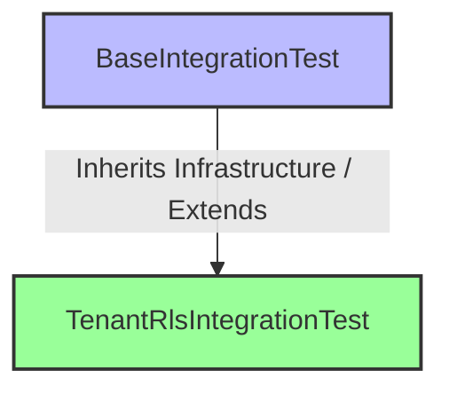
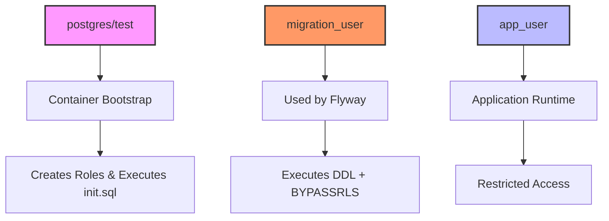
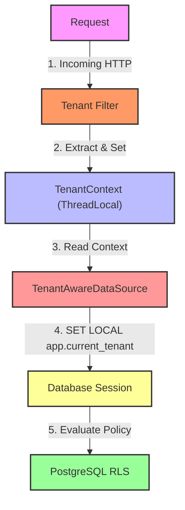
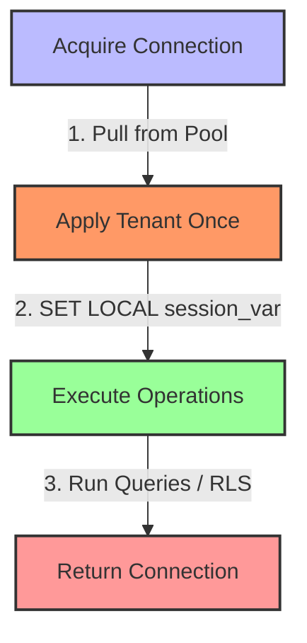
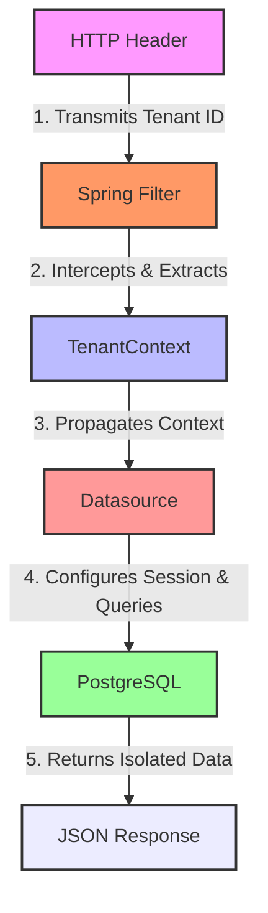
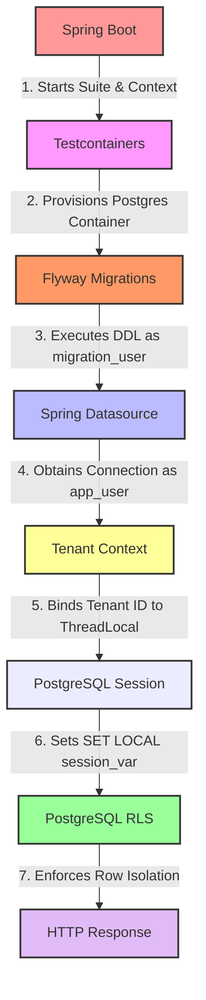

# Phase 07 — Integration Tests with Spring Boot, Testcontainers and PostgreSQL RLS

## Objective

Validate application behavior in an isolated environment using Spring Boot, Testcontainers and PostgreSQL RLS, ensuring that:

* Spring Boot starts correctly
* Flyway migrations execute automatically
* PostgreSQL roles are initialized correctly
* Runtime executes with restricted permissions
* Tenant context propagates correctly
* PostgreSQL RLS enforces data isolation
* Tests do not depend on local infrastructure

---

## Problem Statement

The application previously depended on a manually started PostgreSQL instance:

```text
localhost:5432
```

This approach had limitations:

* tests depended on external infrastructure
* environment configuration could differ between machines
* Flyway migrations could interfere with local databases
* runtime and migration credentials were not isolated

To make tests reproducible, PostgreSQL was moved into Testcontainers.

---

## Dependencies

```xml
<dependency>
    <groupId>org.springframework.boot</groupId>
    <artifactId>spring-boot-testcontainers</artifactId>
    <scope>test</scope>
</dependency>

<dependency>
    <groupId>org.testcontainers</groupId>
    <artifactId>junit-jupiter</artifactId>
    <scope>test</scope>
</dependency>

<dependency>
    <groupId>org.testcontainers</groupId>
    <artifactId>postgresql</artifactId>
    <scope>test</scope>
</dependency>
```

Note:

Testcontainers transitive vulnerabilities were intentionally not overridden because these dependencies exist only in test scope and are not packaged in runtime artifacts.

---

## Test Infrastructure

A reusable integration base was introduced.



Responsibilities:

### BaseIntegrationTest

Provides:

* PostgreSQL Testcontainer
* Spring Boot integration
* datasource override
* Flyway configuration

### TenantRlsIntegrationTest

Validates:

* runtime permissions
* session variables
* RLS filtering
* HTTP integration

---

## Initializing PostgreSQL for Tests

Container bootstrap:

```java
@SpringBootTest
@Testcontainers
abstract class BaseIntegrationTest {

    @Container
    static final PostgreSQLContainer<?> postgres =
            new PostgreSQLContainer<>("postgres:17")
                    .withDatabaseName("dbRLSTest")
                    .withInitScript(
                            "db/init/00-test-init.sql"
                    );

}
```

The initialization script executes before Spring starts.

Responsibilities:

* create database roles
* enable extensions
* configure migration access

---

## Dynamic Property Injection

Application configuration points to localhost.

Integration tests override those values dynamically:

```java
@DynamicPropertySource
static void configureProperties(DynamicPropertyRegistry registry) {
    String jdbcUrl = postgres.getJdbcUrl();

    registry.add("spring.flyway.url", () -> jdbcUrl);
    registry.add("spring.flyway.user", () -> MIGRATION_USER);
    registry.add("spring.flyway.password", () -> "migration_password");

    registry.add("spring.datasource.url", () -> jdbcUrl);
    registry.add("spring.datasource.username", () -> APP_USER);
    registry.add("spring.datasource.password", () -> "app_password");
}
```

This guarantees that tests never connect to localhost.

---

## Database Role Separation

Three users participate in execution.



This separation simulates production responsibilities.

---

## Why @ServiceConnection Was Not Used

Spring Boot provides:

```java
@ServiceConnection
```

This feature simplifies container integration.

However, this lab intentionally separates database responsibilities.

Using `@ServiceConnection` caused datasource credentials to be overridden.

Result:

```text
runtime → container user
```

instead of:

```text
runtime → app_user
```

For this architecture, `@DynamicPropertySource` provided explicit control.

---

## Runtime Validation

To ensure runtime permissions were applied correctly:

```java
@Test
void readCurrentUser() {

    String currentUser =
            jdbcTemplate.queryForObject(
                    "select current_user",
                    String.class
            );

    System.out.println(
            "Current User: "
                    + currentUser
    );

}
```

Output:

```text
Current User: app_user
```

This confirms that:

* migrations executed with migration_user
* application executed with app_user
* runtime did not inherit elevated privileges

---

## Tenant Context Propagation

The application must propagate tenant information from request execution to PostgreSQL.

Flow:



The datasource applies:

```sql
SET app.current_tenant = '<tenant-id>'
```

before executing queries.

---

## Why Tenant Is Applied Per Connection

Initial idea:

```text
Before every SELECT
Before every UPDATE
Before every DELETE
```

This was rejected.

Transactions may execute multiple operations using the same connection.

Final approach:



---

## ThreadLocal Lifecycle

Tenant values must not leak.

Important rule:

```text
ThreadLocal.remove()
```

clears only the current thread.

Connection reuse remains the real risk.

Cleanup is executed after tests.

Example:

```java
@AfterEach
void clearTenant() {
    TenantContext.clear();
}
```

---

## Tenant Fixture

Tenant IDs are generated dynamically.

To avoid hardcoded values, `TenantFixture` was introduced.

Example:

```java
tenantFixture.hospitalA();
tenantFixture.hospitalB();
```

Responsibilities:

* discover tenant IDs
* cache values
* simplify test readability

---

## Integration Coverage

Validated scenarios:

### Database Connectivity

```text
Application connects as app_user
```

### Session Variables

```sql
-- TenantContext propagates to:
SELECT current_setting('app.current_tenant');
```

### RLS Filtering

```text
Hospital A → Alice

Hospital B → Bob

Unknown Tenant → Empty Result
```

### HTTP Integration

Using MockMvc:



Example:

```text
Hospital A
→ returns Alice

Unknown Tenant
→ returns []
```

---

## Unexpected Issues During Implementation

Main discoveries:

* duplicate `@SpringBootTest`
* datasource override conflicts
* `@ServiceConnection` limitations
* role initialization order
* ResultSet cursor misuse
* localhost configuration leakage

Root cause analysis was performed layer by layer.

### RLS Policies Must Handle Missing Tenant Context

During integration testing, unexpected behavior was discovered when validating tenant isolation across multiple sequential HTTP requests.

#### The Scenario
* **Request 1:** `X-Tenant-Id: hospital-a-uuid` → Successfully returns `[Alice]`.
* **Request 2:** No tenant header provided → Expected: `[]` (Empty list).

**Actual Result:**
```text
org.postgresql.util.PSQLException: ERROR: invalid input syntax for type uuid: ""

```

#### Root Cause Analysis

The issue was **not** caused by a `ThreadLocal` memory leak. The application correctly executed `TenantContext.clear()`, and the database pool executed:

```sql
-- or RESET app.current_tenant
SET app.current_tenant = '';
```

However, the original PostgreSQL RLS policy performed a direct string-to-UUID conversion:

```sql
current_setting('app.current_tenant', true)::uuid
```

When the session variable was cleared (becoming an empty string `''`), PostgreSQL attempted to execute `''::uuid`, which is syntactically invalid for the `UUID` data type, throwing a `500 Internal Server Error`.

#### Solution

All Row-Level Security (RLS) policies were updated to safely tolerate empty or missing tenant contexts using `NULLIF`.

**Before:**

```sql
USING 
    (tenant_id = current_setting('app.current_tenant', true)::uuid)
WITH CHECK 
    (tenant_id = current_setting('app.current_tenant', true)::uuid);

```

**After:**

```sql
USING 
    (tenant_id = 
            NULLIF(current_setting('app.current_tenant', true), '')::uuid)
WITH CHECK 
    (tenant_id = 
            NULLIF(current_setting('app.current_tenant', true), '')::uuid);

```

### Why This Works (Execution Flow)

* **Old Broken Flow:** `''` (Empty) → `::uuid` (Cast) → **`PSQLException (Invalid Syntax)`**
* **New Resilient Flow:** `''` (Empty) → `NULLIF('', '')` → `NULL` → `NULL::uuid` (Valid) → `tenant_id = NULL` → **`Safe Empty Result []`**

### Architectural Lesson

Database-level security policies must be defensive and should never assume the application state is always present or perfectly populated.

A missing or cleared tenant context must fail closed (**no access / empty result**), never open, and should not crash the database engine with an unhandled exception. This improvement makes our RLS implementation resilient against:

* Missing or malformed HTTP headers.
* Cleared `ThreadLocal` contexts in async threads.
* Recycled or dirty pooled database connections.

---

## Key Learnings

* Integration tests should not depend on localhost
* Testcontainers improves reproducibility
* Flyway and runtime users may differ
* Container bootstrap is independent of runtime access
* `@ServiceConnection` is useful but not universal
* `@DynamicPropertySource` provides explicit configuration control
* `SELECT current_user` is a simple way to validate active credentials
* RLS policies should tolerate missing tenant context and fail closed

---

## Final Result

Integration tests now validate:



Validated:

* isolated infrastructure
* runtime permissions
* tenant propagation
* database filtering
* HTTP integration
* end-to-end tenant isolation

Phase completed successfully.
