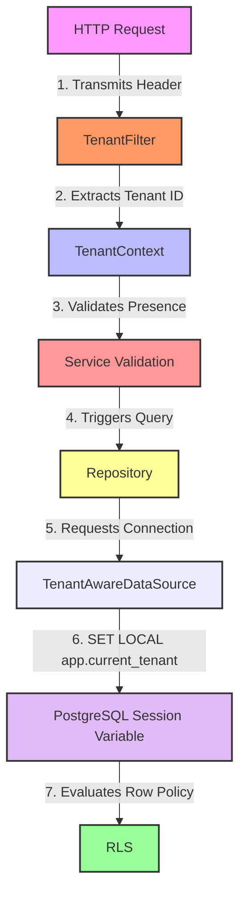
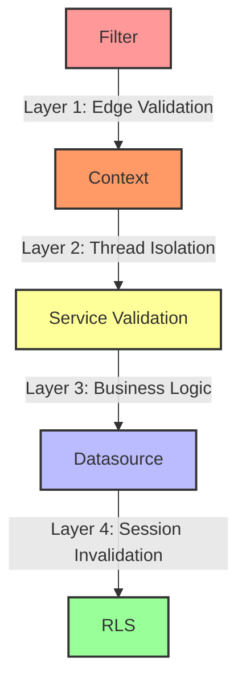

# Phase 08 — Write Isolation with JdbcTemplate and PostgreSQL RLS

## Objective

Extend tenant isolation from read operations to write operations.

Until the previous phase, PostgreSQL Row Level Security (RLS) was protecting data visibility.

This phase validates that:

* writes execute under the active tenant context
* inserts cannot bypass tenant boundaries
* runtime validates tenant presence before persistence
* PostgreSQL remains the final protection layer

The implementation intentionally keeps `JdbcTemplate` to validate behavior before introducing ORM abstractions.

---

## Problem Statement

Previous phases validated:

```text
tenant → SELECT → isolated rows
```

But write operations were not yet protected.

Without explicit controls, inserts could introduce:

```text
cross-tenant writes
or
records without tenant ownership
```

The goal became enforcing tenant isolation during creation.

---

## Architectural Flow

Write requests now follow:



This separates responsibilities.

---

## Service Layer Introduction

A service layer was introduced between controller and repository.

Responsibilities:

* validate business rules
* define transaction boundaries
* stop invalid execution early

Implementation:

```java
@Service
public class PatientService {

    @Transactional
    public void create(
            CreatePatientRequest request
    ) {

        if (
                !StringUtils.hasText(
                        TenantContext.getTenantId()
                )
        ) {
            throw new IllegalStateException(
                    "Tenant not set"
            );
        }

        repository.create(
                request.name()
        );

    }

}
```

This introduced fail-fast validation.

---

## Repository Write Implementation

Patient creation remained intentionally simple.

```java
public static final String INSERT =
        """
        INSERT INTO patients (
            name,
            tenant_id
        )
        VALUES (
            ?,
            current_setting(
                'app.current_tenant'
            )::uuid
        )
        """;
```

Important decision:

Tenant ownership is not accepted from request payload.

Ownership is derived from database session state.

Result:

```text
request
↓
session
↓
database
```

instead of:

```text
request
↓
tenant_id
↓
database
```

---

## Why tenant_id Was Not Accepted From API

An alternative would be:

```json
{
  "name": "Charlie",
  "tenantId": "..."
}
```

This approach was intentionally rejected.

Reasons:

* ownership becomes user-controlled
* accidental cross-tenant writes become possible
* application and database may diverge

The selected model guarantees:

```text
tenant source of truth
=
database session
```

---

## Controller Changes

Controller now delegates persistence.

Example:

```java
@PostMapping("/patients")
public ResponseEntity<Void> create(
        @RequestBody
        CreatePatientRequest request
) {

    patientService.create(
            request
    );

    return ResponseEntity
            .status(
                    HttpStatus.CREATED
            )
            .build();

}
```

---

## Runtime Validation

Tenant absence now fails before SQL execution.

Integration test:

```java
@Test
void shouldRejectInsertWithoutTenant()
```

Validation:

```text
POST
without tenant
↓
IllegalStateException
↓
repository not executed
```

This replaced database-driven failures with application-level validation.

---

## Write Isolation Validation

Insert executed under Hospital A:

```text
POST /database/patients
X-Tenant-Id: HospitalA
```

Read executed under Hospital B:

```text
GET /database/patients
X-Tenant-Id: HospitalB
```

Validation:

```java
.andExpect(
    jsonPath(
        "$[*].name"
    )
    .value(
        not(
            hasItem(
                "Dave"
            )
        )
    )
);
```

Result:

```text
Hospital B
cannot read
Hospital A writes
```

---

## Defense in Depth

Protection now exists at multiple layers.



This ensures that:

* application validates intent
* database guarantees enforcement

Even if application logic diverges, RLS remains authoritative.

---

## Key Learnings

* write isolation must be validated independently
* tenant ownership should not come from payload
* service layer improves failure semantics
* fail-fast reduces unnecessary database execution
* RLS remains valuable even after application validation
* JdbcTemplate is sufficient to validate architecture before ORM adoption

---

## Final Result

The application now supports:

```text
tenant-aware reads
+
tenant-aware writes
+
runtime validation
+
database enforcement
```

Phase completed successfully.
